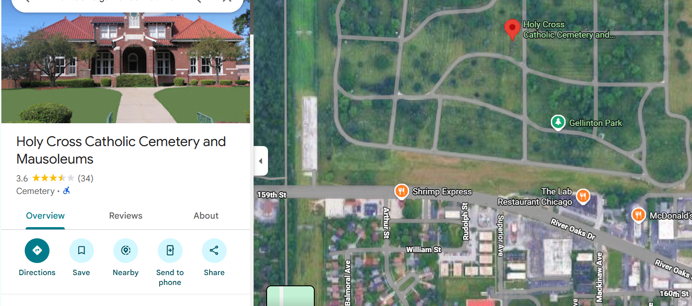
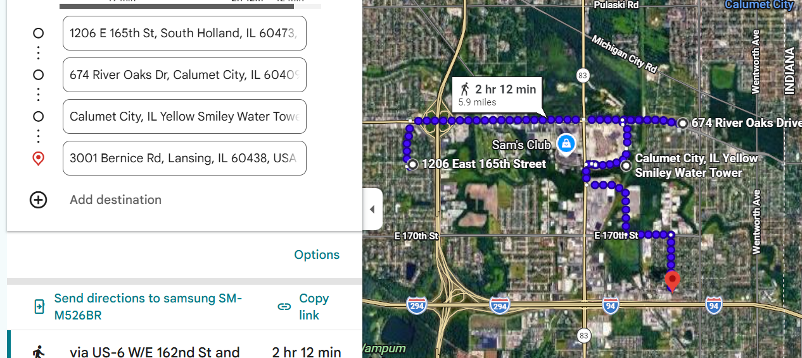
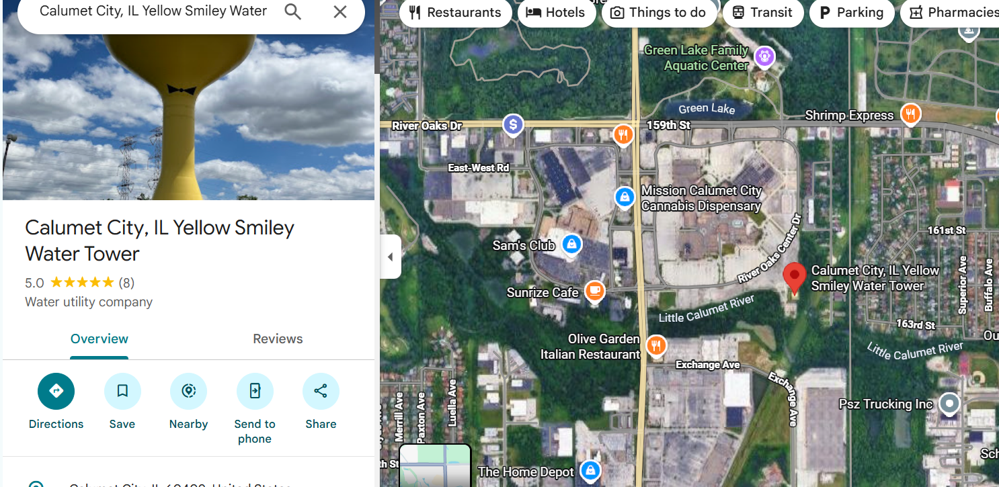
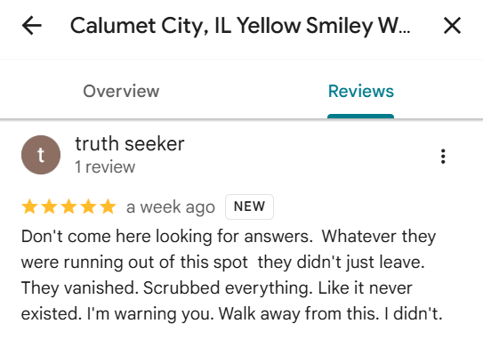
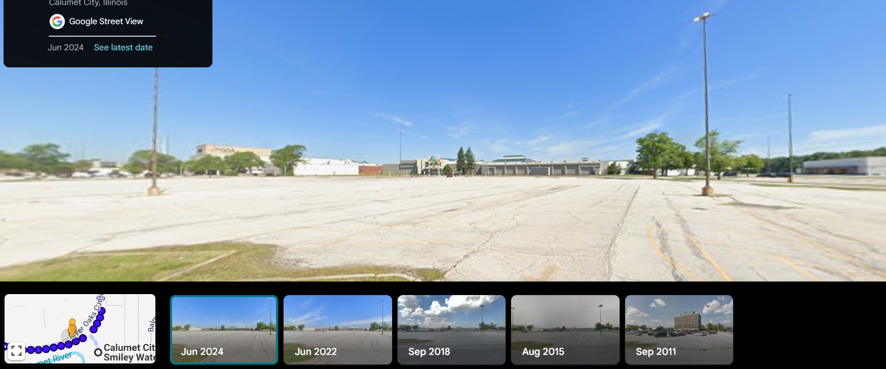
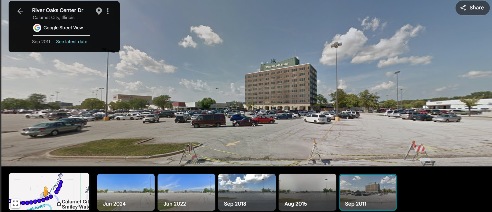

# CTF Writeup: Cursed Arcade

## Challenge Overview
* **Name:** Cursed Arcade
* **Author:** 4mdj4d
* **Category:** OSINT
* **Description:** Two people died. Same game. Years apart. The cases are closed. IntruderAlert82 was a conspiracy theorist who believed a secret cult was operating behind it all. He was investigating. Now he's gone too. Find the place they used to operate from.
* **Flag:** `nmctf{Westwood_College}`

---

## Solution Walkthrough

### Initial Recon
The challenge description gives us a clear starting point: the username `IntruderAlert82`. A quick search across social media platforms leads us to a Twitter/X account belonging to "Truth seeker" (@IntruderAlert82). 

The account has a thread of four tweets from June 14, 2026. To solve this, we have to decode them chronologically.

### Decrypting the Thread

**Tweet 1:**
> *"They expect us to believe it was natural? . A healthy 18-year-old’s heart just stops dead ..."*

This gives us the context of the "cursed game" mentioned in the description. Searching for an 18-year-old dying of a heart attack playing an arcade game leads directly to **Berzerk**. In 1982, Peter Burkowski (18) collapsed after posting a high score. The handle `IntruderAlert82` confirms this—"Intruder alert!" is the game's famous voice line.

**Tweet 2:**
> *"I went back. I stood there. Most people walk past it every day and don't feel anything. I felt everything. They built it right next to where the dead sleep. That's not an accident. That's a message"*

Where did Peter Burkowski die? Historical records show the incident happened at **Friar Tuck’s Game Room** in **Calumet City, Illinois**. The tweet mentions it being built "right next to where the dead sleep." Checking a map of Calumet City confirms that the massive Holy Cross Cemetery sits right in the middle of town, near the old commercial district. We are geographically locked into Calumet City.

**Tweet 3:**
> *"Every time I drive between the sites , the place it happened, where he lived, where the other one lived , Otto is always always there. Watching me"*

 "Otto" refers to Evil Otto, the bouncing yellow smiley-face villain from *Berzerk*. But how can a video game character watch you drive around a real city? you can either search for `Calumet City "smiley face"`, and immediately hit the famous **Calumet City Smiley Face Water Towers**. Or you can locate the three places and travel between them with streetView you fill find it right in the middle 

 

 

**Tweet 4: The Note**
> *"This isnt safe ! i feel that i am beign watched , i left a note there incase anything happens to me ."*

"There" refers to the water towers. Since we can't physically travel to Calumet City to find a piece of paper, we have to look for a digital footprint at the landmark. 

### Extracting the Note
We pull up the Calumet City Smiley Face Water Towers on Google Maps and check the public reviews. Scrolling through, we find a review left by our target, "Truth seeker":

> *"Don't come here looking for answers. Whatever they were running out of this spot they didn't just leave. They vanished. Scrubbed everything. Like it never existed. I'm warning you. Walk away from this. I didn't."*

### Street View Time Travel
The review states that whatever organization was operating "out of this spot" (near the water towers) vanished and was "scrubbed" so it looks "like it never existed." 

The challenge prompt asked us to: *"Find the place they used to operate from."*

If we drop the Google Maps Street View pegman right at the water towers today, we just see modern buildings. But the note says it was scrubbed. We need to look at the past.

Using the **Google Maps Street View historical imagery tool** (the clock icon in the top left corner), we can roll back the timeline. When we drag the slider back to **2011** and look around the area directly beneath the water towers, a massive building appears that isn't there anymore: **Westwood College**. 

Westwood College was a highly controversial, for-profit institution sued for predatory practices—acting very much like the "secret cult" the target was investigating before it permanently shut down.

**Flag:** `nmctf{Westwood_College}`
